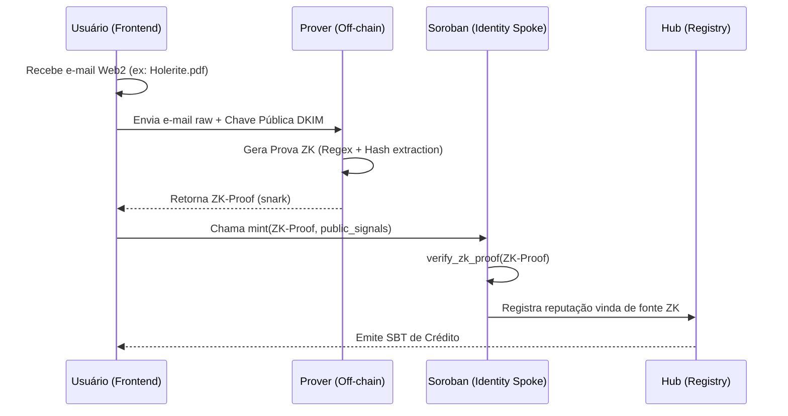

# ZK-Email Integration Flow: Technical Visual Guide
## How Zolvency Validates Web2 Cashflow without Data Exposure

**Versão:** 1.0  
**Status:** Technical Baseline  
**Data:** 27 de Abril de 2026  

---

## 1. Visão Geral do Fluxo (High Level)

O Zolvency utiliza o padrão **ZK-Email** para extrair dados de e-mails assinados via DKIM (DomainKeys Identified Mail). Isso permite que um usuário prove sua renda (via e-mail do banco ou folha de pagamento) sem revelar o conteúdo completo do e-mail ao contrato Soroban.

### 1.1 Diagrama de Sequência



---

## 2. Anatomia da Prova ZK

O circuito ZK do Zolvency (Spoke de Recebíveis) foca em três campos principais:

1.  **DKIM Signature Validation:** Prova que o e-mail foi realmente enviado pelo domínio especificado (ex: `@banco.com.br`).
2.  **Amount Extraction (Regex):** Extrai o valor do depósito (ex: `R$ 5.000,00`) usando expressões regulares dentro da prova ZK.
3.  **Nullifier Generation:** Gera um hash único baseado no e-mail para evitar que o usuário tente "reutilizar" o mesmo e-mail para gerar dois SBTs (Double-Spending Attack).

---

## 3. O Verificador Soroban (Hook)

No contrato Soroban, a função `verify_proof` (invocada pelo Spoke) recebe os sinais públicos:

```rust
// Snippet conceitual do Spoke
pub fn verify_zk_email(env: Env, proof: Bytes, signals: Vec<Val>) -> bool {
    let verifier_address = env.storage().instance().get(&DataKey::ZkVerifier).unwrap();
    
    // O verificador ZK pode ser um contrato especializado em Groth16 ou PlonK
    env.invoke_contract(
        &verifier_address,
        &Symbol::new(&env, "verify_snark"),
        Vec::from_array(&env, [proof, signals])
    )
}
```

---

## 4. Análise de Performance e Latência

| Fase | Local | Tempo Estimado | Custo (Gas) |
| :--- | :--- | :--- | :--- |
| Geração da Prova | Cliente/Browser | 2-5 minutos | Zero (Local) |
| Verificação On-chain | Soroban | < 5 segundos | ~0.5 XLM |
| Atualização de Hub | Soroban | < 1 segundo | ~0.1 XLM |

---

## 5. Glossário de Novos Nós
- [[DKIM-Verification]]: Método de autenticação de e-mail que o ZK-Email utiliza como base.
- [[ZK-Regex-Extraction]]: Técnica de extração de dados de texto puro dentro de um ambiente criptográfico.
- [[Nullifier-Registry]]: Base de dados de hashes de e-mails já processados para evitar fraude.
